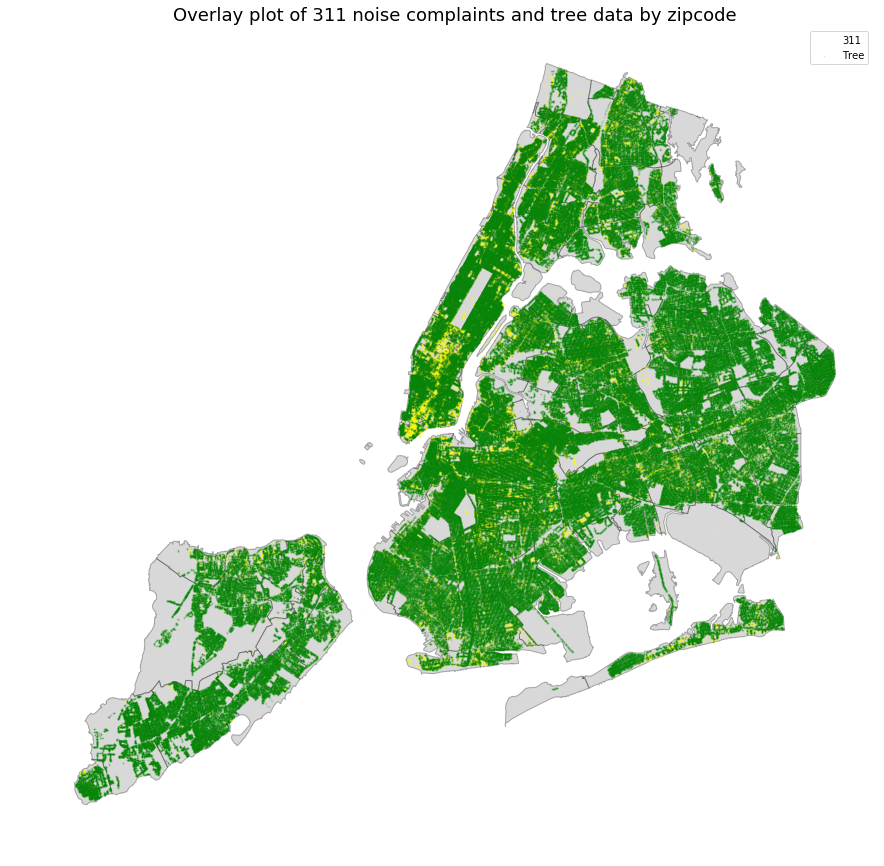
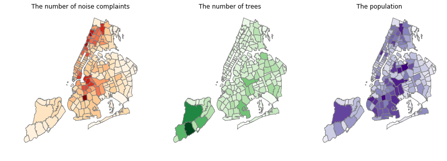

# This is Homework 11 Repo of Keundeok Park.
### Homework 11 done by kp2393(Keundeok Park) working with marvin.

## Assignment 1:
* On the progress

## Assignment 2:

Figure 1. This map shows the spatial distribution of 311 noise complaint data and trees by zipcode in NYC.

Figure 2. Cartographs show the number of noise complatins, the number of trees and the population respectively by zipcode in NYC.

Commented by mh5172 & wyw238