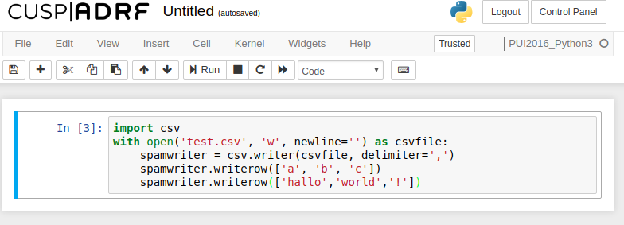
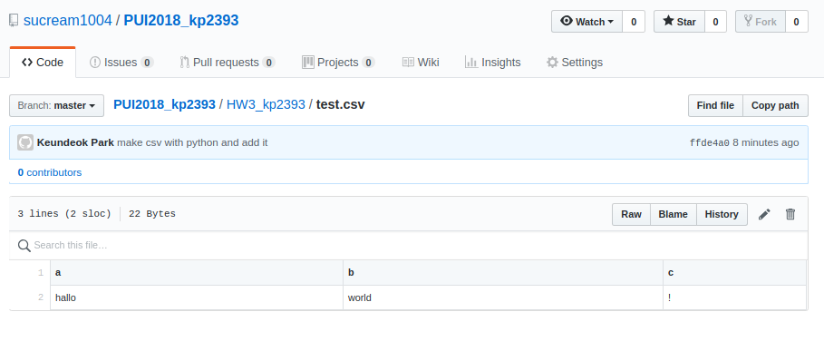
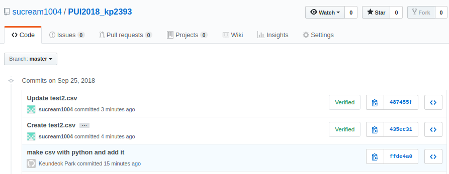
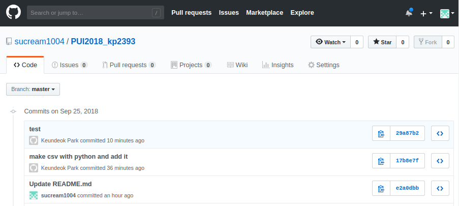
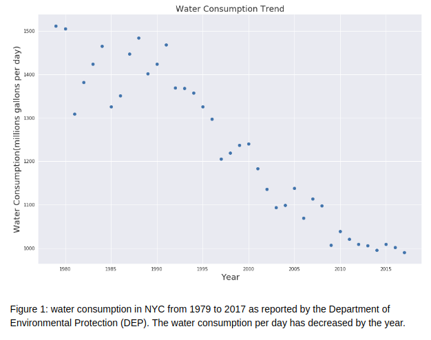
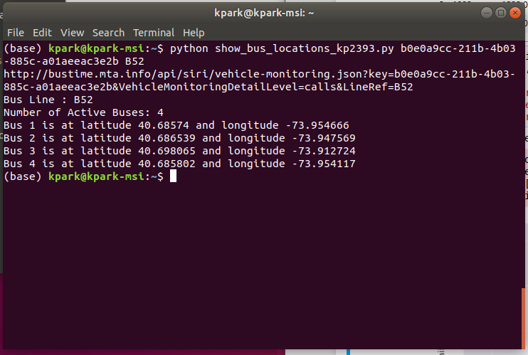
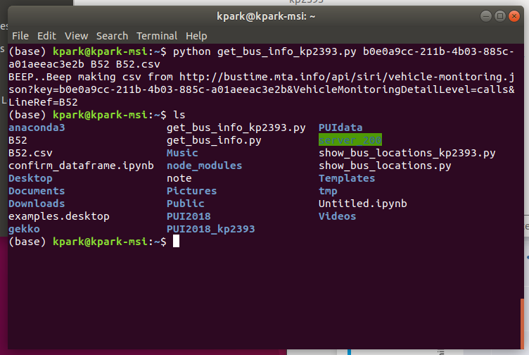

# Part1. Remove Sensitive Data from github
1. Create test.csv
```
  a, b, c
  Hallo, World, !
```
- Tried to make csv with python.

- This is How it looks like.

- Oh.. I made 1 more csv file named test1.csv because I misunderstood the way to make csv file, just in case.

- Type bash command to remove history.
```
$git filter-branch --force --index-filter 'git rm --cached --ignore-unmatch HW3_kp2393/test.csv HW3_kp2393/test2.csv' --prune-empty --tag-name-filter cat -- --all
$git push origin --force --all
```
- The next figure is result.

# Part2. Import data from NYC open data
- example of chart and included in ipython script.

# Part3. Making simple python code tracking MTA bus
- First python code save as show_bus_locations_kp2393.py

- Second python code save as get_bus_info_kp2393.py

