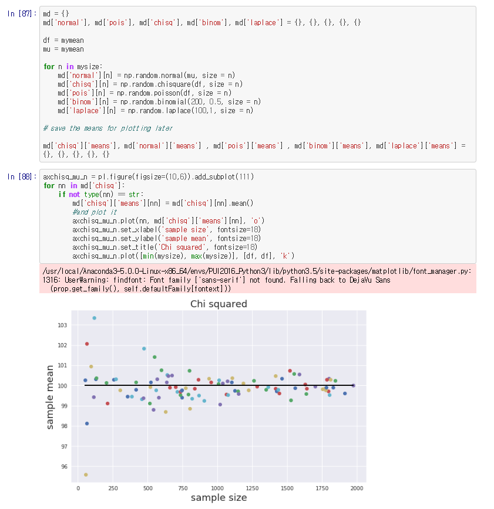
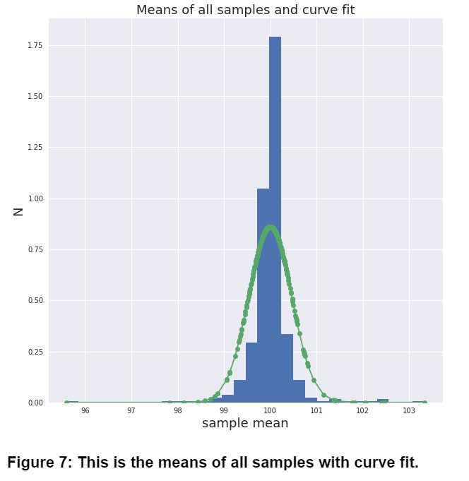
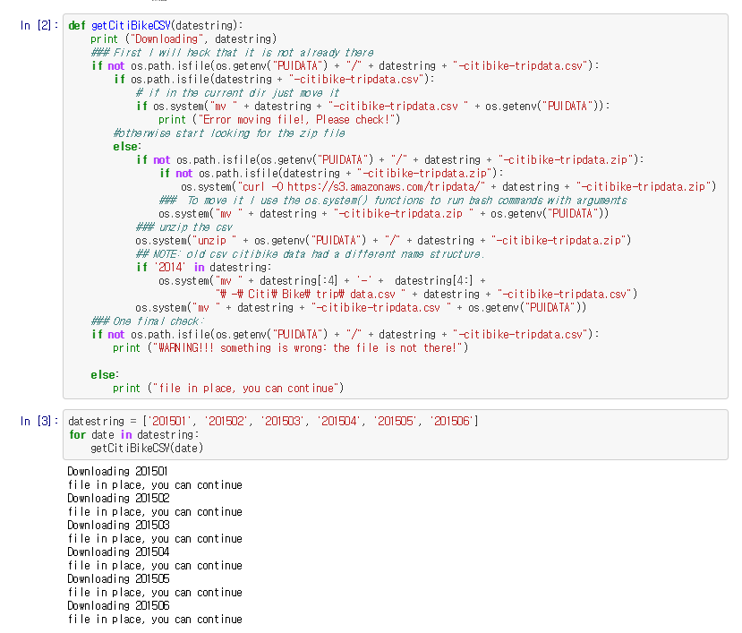
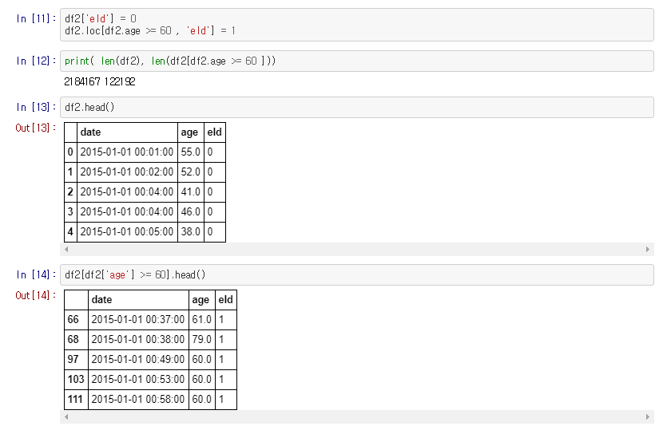
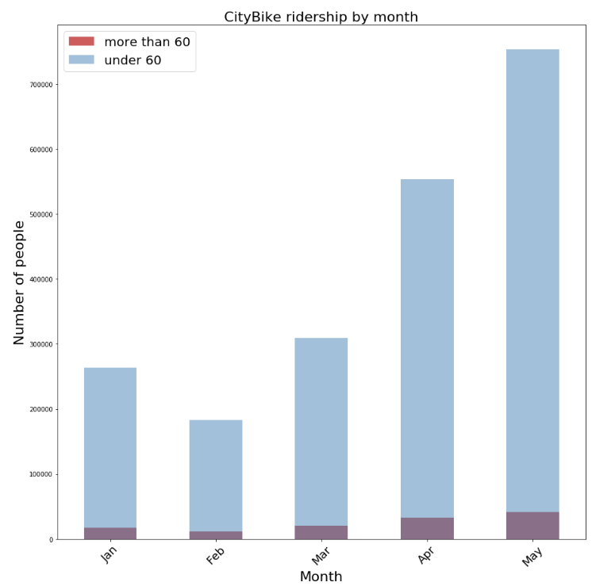

# This is HW4_kp2393
- Worked by keundeok park alone
- At this time, we are going to look into data distribution

## assignment 1: Write an ipython notebook that demonstrates visually in a data-driven way the Central Limit Theorem.
- Central Limit Theorem: Regardless population distribution, distribution of sample means are getting closer to normal distribution as sample size is getting bigger. Sample mean is same as population mean and sample standard deviation is same as population standard deviation divided by sqrt(N).
- It must be included normal, poisson, chi-squared and binomial distribution with additional distribution that I choose which is laplace.

### 1-1: Before I start to generate distribution, I made 100 numbers which would be used for making samples with different sample sizes.

### 1-2: Making samples and plot the samples.

### 1-3: Lastly, combining 500 samples and plot distribution.

## assignment 2: Set up the work for data-driven inference based on CitiBike data.
- Making null and alternative hypothesis with realworld data which is CitiBike.
- I am looking into CitiBike data to find out that rider who is more than 60 years old tend to be affected by seasonal effect more than under 60 years old.

### 2-1: Downloading data from "https://s3.amazonaws.com/tripdata/" according to instruction of prof. Bianco.

### 2-2: Setting new dataframe with essential columns and adding column which represents age group.

### 2-3: Checking the data with plot(first: absolute, second: normalized).

