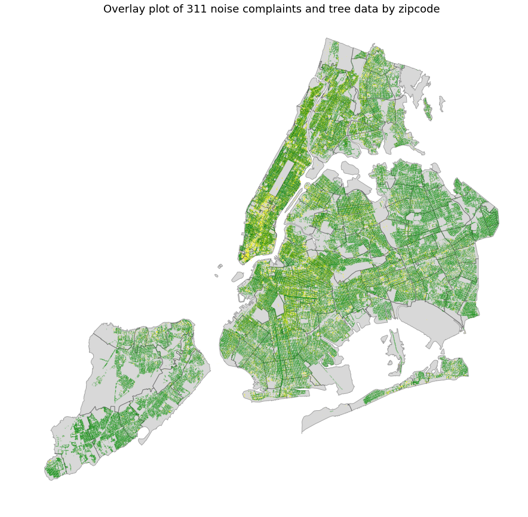
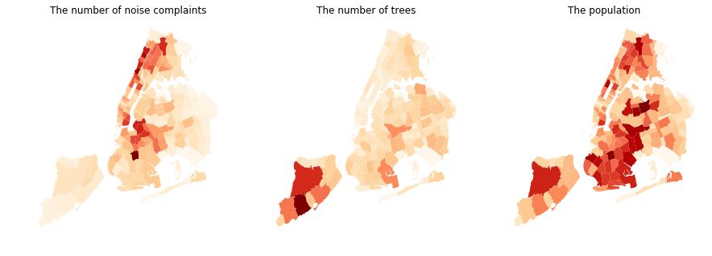
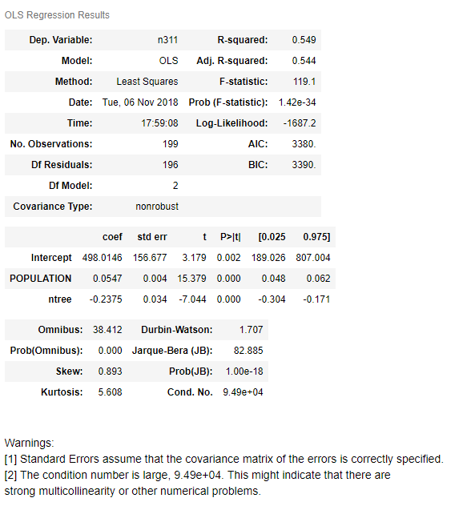

# This is Homework 8 Repo of Keundeok Park.
### Homework 8 done by kp2393(Keundeok Park) alone.

## Assignment 1:
* I used tree data, 311 noise complaint data and zipcode to find out effect of tree to reduce noise.

#### Figure 1. This map shows the spatial distribution of 311 noise complaint data and trees by zipcode in NYC.

#### Figure 2. Cartographs show the number of noise complatins, the number of trees and the population respectively by zipcode in NYC.

#### Table1. We employed multivariable regression to find out effects of tree on the number of noise complaints in New York City. The population variable is used as control variable. The result is showing that the number of trees tend to reduce noise complaints in NYC. It suggest that more trees could reduce the noise bothering citizen.

## Assignment 2:
* Uploaded to [Authorea](https://www.authorea.com/users/249616/articles/335959-difference-behavior-between-elderly)
